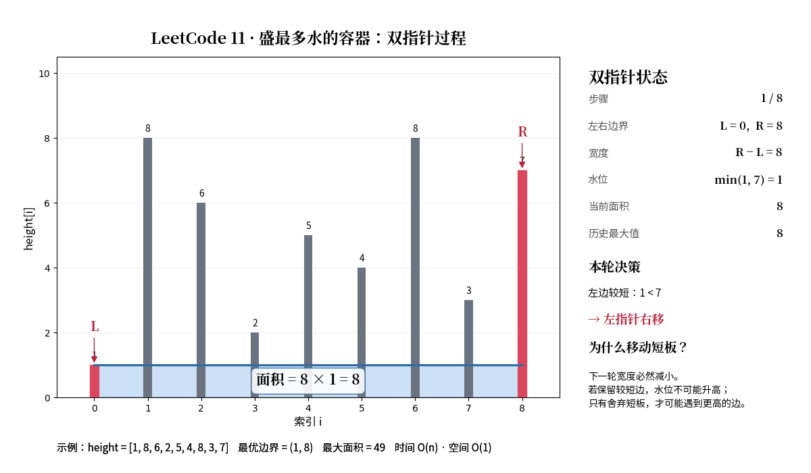

# 11. 盛最多水的容器

## 题目描述

给定一个长度为 n 的整数数组 height，有 n 条垂线，第 i 条线的两个端点是 (i, 0) 和 (i, height[i])。

找出其中的两条线，使得它们与 x 轴共同构成的容器可以容纳最多的水。

## 解题思路

### 第一次尝试（暴力解法）

**思路**：遍历所有下标组合，计算对应的宽和高，求最大面积。

```python
class Solution:
    def maxArea(self, height: List[int]) -> int:
        maxresult = 0
        length = len(height)
        for i in range(length):
            for j in range(i, length):
                w = j - i
                h = min(height[j], height[i])
                area = w * h
                maxresult = max(maxresult, area)
        return maxresult
```

**结果**：时间复杂度 O(n²)，超时。

### 第二次尝试（双指针）

**思路**：双指针分别指向两头，移动短的那一端。

**关键洞察**：短板效应
- 如果移动长端，最好的结果只是高度不变，宽度下降，面积一定下降
- 所以移动长边的情况全部被剪枝

```python
class Solution:
    def maxArea(self, height: List[int]) -> int:
        n = len(height)
        left = 0
        right = n - 1
        maxresult = 0
        while(left != right):
            w = right - left
            h = min(height[left] ,height[right])
            area = w * h
            maxresult = max(maxresult, area)
            if height[left] <= height[right]:
                left += 1
            else:
                right -= 1
        return maxresult
```

**结果**：通过，时间复杂度 O(n)。

## 核心知识点

- **双指针**：从两端向中间收敛
- **剪枝依据**：短板效应，移动短端才能可能找到更大的面积
- **时间复杂度**：O(n)

## 相关题目

- [[15. 三数之和]] - 同样使用双指针

## 图示



