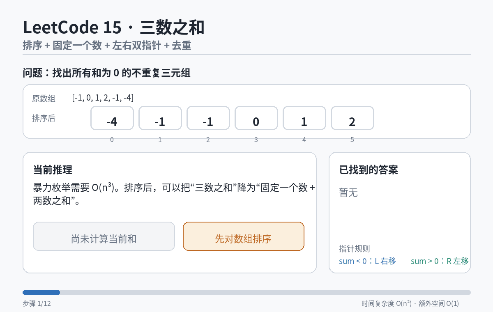

# 15. 三数之和

## 题目描述

给你一个整数数组 nums，判断是否存在三元组 [nums[i], nums[j], nums[k]] 满足 i != j、i != k 且 j != k，同时还满足 nums[i] + nums[j] + nums[k] == 0。返回所有和为 0 且不重复的三元组。

## 解题思路

### 第一次尝试（暴力解法）

**思路**：三个 for 循环遍历。

```python
class Solution:
    def threeSum(self, nums: list[int]) -> list[list[int]]:
        n = len(nums)
        result = []
        for i in range(n):
            for j in range(i+1, n):
                for k in range(j+1, n):
                    if k == n-1:
                        continue
                    else:
                        sums = nums[i] + nums[j] + nums[k]
                        arr = [nums[i], nums[j], nums[k]]
                        if sums == 0:
                            result.append(arr)
        return result
```

**结果**：样例没过，因为没有去重。

### 第二次尝试（排序 + 双指针）

**思路**：
1. 固定一个值，变成双指针问题
2. 排序后用双指针收敛找和为0的组合
3. 去重：先取值再跳过重复



```python
class Solution:
    def threeSum(self, nums: List[int]) -> List[List[int]]:
        nums.sort()
        n = len(nums)
        res = []
        
        for fixed in range(n-2):
            if nums[fixed] > 0:
                break
            if fixed > 0 and nums[fixed] == nums[fixed - 1]:
                continue
            left = fixed + 1
            right = n-1
            while left < right:
                total = nums[fixed] + nums[left] + nums[right]
                if total == 0:
                    res.append([nums[fixed], nums[left], nums[right]])
                    while left < right and nums[left] == nums[left + 1]:
                        left += 1
                    while right > left and nums[right] == nums[right - 1]:
                        right -= 1
                    left += 1
                    right -= 1
                elif total < 0:
                    left += 1
                else:
                    right -= 1
                    
        return res
```

**结果**：通过。

## 核心知识点

- **排序**：失去位置关系，获得顺序关系
- **固定一个值 + 双指针**：三指针问题转化为两指针
- **去重策略**：先取值（计算total），确认有答案后再跳过重复
- **边界处理**：nums[fixed] > 0 时直接break

## 关键经验

### 去重顺序的重要性

**必须先取值再去重，顺序不能反。**

原因：
1. **先去重会"刻舟求剑"**：还没计算total就移动指针，可能把正确答案跳过
2. **后去重是"见机行事"**：确认找到答案后，才跳过必然重复的路径
3. **total != 0时更不能去重**：重复值可能和别的指针组成答案

**比喻**：像在果园摘水果，先伸手拿到苹果确认是好的，再把紧挨着的一样苹果摘掉。

## 相关题目

- [[11. 盛最多水的容器]] - 同样使用双指针
